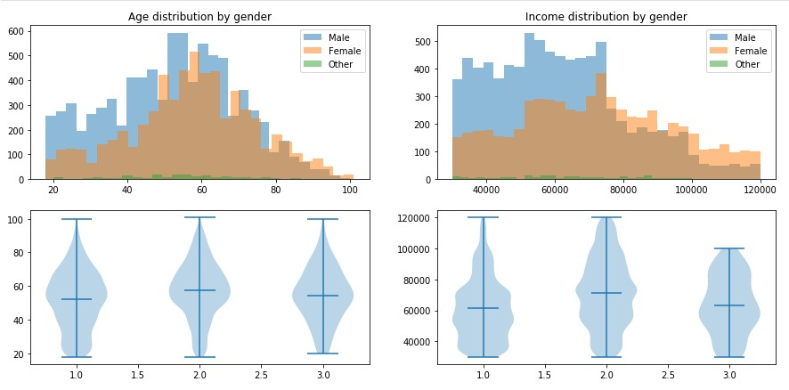
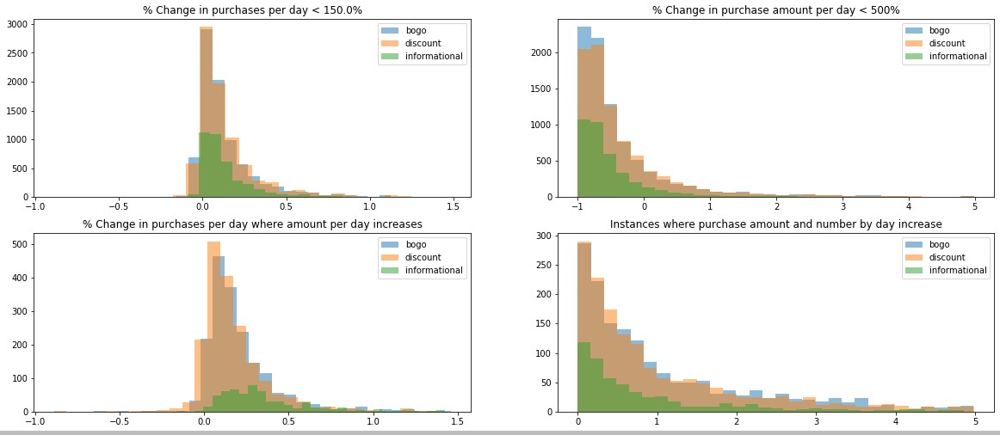

<H2>Do you buy more when things are cheaper?</H2>
<H4><i>
A deeper look at Starbucks’ offers using data science</i></H4>

&nbsp;&nbsp;&nbsp;&nbsp;&nbsp;&nbsp;If you think that trying to wrestle not one, but three of <a href="https://www.starbucks.ca/">Starbucks'</a> simulated customer offer datasets sounds like a lot of fun for a Data nerd, you would be right. Now toss in a harrowing journey where the driver decides to take a leisurely, but more complicated detour, only to double back and follow the path he should have taken, well then, now you’re closer to the story I am about to tell. 

&nbsp;&nbsp;&nbsp;&nbsp;&nbsp;&nbsp;This project was one of many I could have chosen to do for the <a href="https://www.udacity.com/course/data-scientist-nanodegree--nd025">Data Scientist Nanodegree program</a>, but it seemed like a flavorful brew of two things I love, coffee and computer modelling, so it was no contest that it was the one I chose. 

&nbsp;&nbsp;&nbsp;&nbsp;&nbsp;&nbsp;The project’s goal was to determine which demographic groups responded best to which of the three offer types (Buy One Get One free, Discount, Informational). My goal was to do that, but also learn as much as I could without going overboard, while creating a machine learning model that could be used to predict how other customers would be influenced by the offers. 

&nbsp;&nbsp;&nbsp;&nbsp;&nbsp;&nbsp;Wrangling was easily the meat and potatoes of the project, but that’s normal for these sorts of assignments. Once you can get the data cleaned up, lined up, and without any missing pieces, modelling and analysis become the easy part. We had some incomplete profiles, but ultimately decided it was best they were removed rather than imputing any features, as age, gender, and income couldn’t be accurately derived from the attributes at hand, and there were differences between those groups, that if we just averaged it out, might have caused misrepresentation. 

&nbsp;&nbsp;&nbsp;&nbsp;&nbsp;&nbsp;Next was the summary datasets that would be needed for the Random Forests. They helped me see that not all offers are created equally, and although number of transactions may increase as a result of being influenced by an offer, the amount someone spends per day may not also increase. 
 

 
&nbsp;&nbsp;&nbsp;&nbsp;&nbsp;&nbsp;After that came the design of the Random Forest Classifier. The mistake I made, was initially thinking that you should create a powerset, and then a model for every possible combination of attributes, rate their accuracy, and choose the best one. I was wrong, an hour 40 minutes wrong, and thankfully came to my senses and used variable importance instead. If you would like to see how it was done though, I have included the removed code as a separate Jupyter notebook in the repository. 

&nbsp;&nbsp;&nbsp;&nbsp;&nbsp;&nbsp;In the end, demographic groups with either less than a year or 4+ years membership tenure, alongside a 30,000 to 89,999 dollar annual income comprised the majority clusters where at least 20% responded positively to offers and increased their average per day purchase amounts. There were some outliers also, but they represented only a few people. 

&nbsp;&nbsp;&nbsp;&nbsp;&nbsp;&nbsp;I learned, remembered, detoured, and had some pretty good fun with this project. The dataset presented some real-world challenges, and I had to flex both my basic analysis, and machine learning muscles in order to make sense of it all. If you want to dive into the actual code, just check out the repository. 

<b>What’s your next Data Science project?</b>
</body>